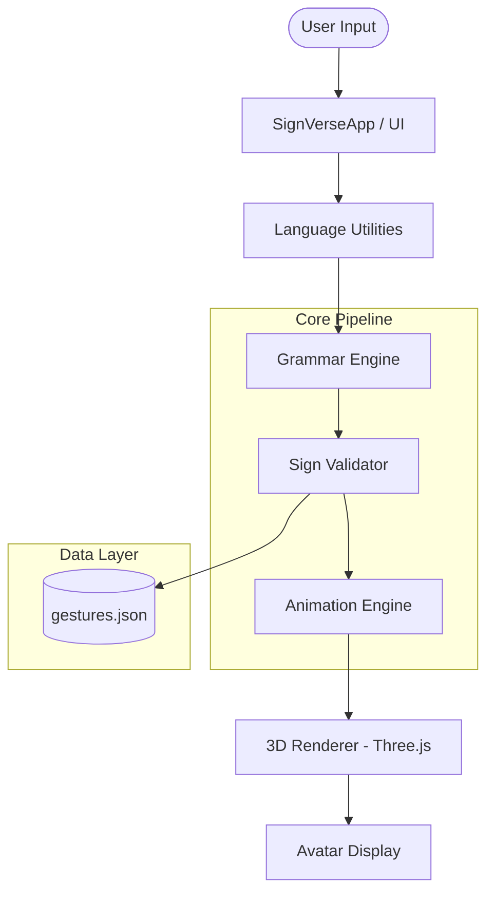

# 🤟 SignVerse: main (Animation & Translation Engine)

## 📑 Executive Summary

**main** represents the core technical infrastructure of the SignVerse ecosystem, functioning as a high-performance, Python-based engine designed to bridge the gap between natural language and visual signing. By synthesizing advanced NLP techniques with a real-time 3D animation pipeline, main enables the seamless translation of text into linguistically accurate Indian Sign Language (ISL) gestures. The engine is built for modularity and scalability, ensuring that it can serve as a robust foundation for various accessibility-focused applications, from real-time interpretation layers to interactive educational platforms.

---

## 📐 Architectural Philosophy & Design

The architecture of main is rooted in a decoupled, multi-layer philosophy that ensures each stage of the translation process is both isolated and optimized. This design allows developers to refine the linguistic rules or animation algorithms independently without disrupting the overall system flow.



### The Linguistic Translation Pipeline
The process begins in the **Grammar Engine**, which serves as the primary processing hub for incoming text. Unlike a simple word-for-word replacement system, main performs deep syntactic analysis to normalize input, strip semantic noise such as stop-words, and apply ISL-specific reordering rules. This ensures that the resulting sign sequence adheres to the Time-Object-Verb (SOV) structure prevalent in deaf communication, rather than the standard English Subject-Verb-Object (SVO) format.

### Validation and Semantic Mapping
Once the text is structured, it passes through the **Sign Validator**. This layer acts as an intelligent intermediary between the linguistic intent and the available gesture data. It cross-references tokens against the `gestures.json` database to identify direct word matches. In cases where a specific word is missing from the vocabulary, the validator automatically triggers a recursive fallback mechanism, decomposing the word into its constituent characters for **fingerspelling**. This ensures that the engine remains functional even when encountering out-of-vocabulary terms.

### Real-Time Animation Orchestration
The **Animation Engine** is the heartbeat of the system, responsible for the low-level manipulation of the avatar's skeletal structure. It handles the queuing of multiple animation steps and applies sophisticated easing algorithms (specifically Ease-out) to create natural, fluid transitions between poses. By managing the rotation of individual joints in real-time, the engine avoids the "robotic" look common in early sign language simulators, providing a more human-centric visual experience.

---

## 📂 System Directory & Resource Mapping

The project structure is organized to facilitate rapid development and clear separation of concerns. The table below outlines the primary responsibilities of each module within the `main` environment.

| Path | Technical Responsibility |
| :--- | :--- |
| `src/main.py` | Serves as the application entry point and orchestrates the UI, 3D scene, and cross-module communication via NiceGUI. |
| `src/core/engine.py` | Encapsulates the animation logic, managing frame-by-frame interpolation and bone-rotation synchronization. |
| `src/core/grammar.py` | Implements the linguistic transformation rules and text preprocessing algorithms. |
| `src/utils/validator.py` | Manages the integrity of the gesture lookup process and implements the recursive fallback logic. |
| `src/utils/language_utils.py`| Provides a wrapper for external translation services and language detection utilities. |
| `gestures.json` | Acts as the primary NoSQL-style database for all sign language gestures and skeletal poses. |
| `assets/models/` | Houses the high-fidelity GLTF/GLB assets, including the core `xbot.glb` skeletal model. |

---

## 💾 Data Infrastructure: The Gesture Schema

The engine relies on a highly structured `gestures.json` database that maps linguistic tokens to sequences of skeletal poses. Each gesture is defined by an array of poses, where each pose contains a dictionary of bone names and their corresponding Euler rotations. This schema is designed for maximum interoperability, using standard Mixamo bone naming conventions that allow the data to be easily ported to other 3D environments like Unity or Unreal Engine with minimal transformation.

---

## 🛠️ Developer Implementation Guide

### Environmental Setup
To begin development, ensure that your system is equipped with Python 3.9 or higher. We recommend using a virtual environment to isolate dependencies and prevent version conflicts. After activating your environment, the necessary libraries—including **NiceGUI** for the interface and **NumPy** for mathematical operations—can be installed via the provided requirements file.

```bash
# Environment initialization
python -m venv venv
source venv/bin/activate

# Dependency installation
pip install -r requirements.txt
```

### Application Deployment
The application can be launched by executing the `main.py` script. Upon startup, the engine initializes the 3D scene and serves a web-based interface at `http://localhost:8080`. This interface provides a real-time playground for testing translations, calibrating the avatar's position, and monitoring the underlying animation steps.

### Vocabulary Expansion via the Stimulator
The **Avatar Stimulator** is a powerful integrated tool designed for developers and linguists to expand the system's vocabulary without writing code. Users can manually manipulate the avatar's bones using granular sliders to create precise poses. These poses can be sequenced together to form complex signs, which are then persisted directly to the `gestures.json` database. This "live-editing" workflow significantly reduces the time required to add new signs to the system.

---

## 🚀 Performance, Scalability & Future Vision

main is engineered to maintain a consistent 60 FPS frame rate, even during complex signing sequences. By leveraging **Three.js** through the NiceGUI Scene component, the system offloads the intensive 3D rendering tasks to the client's GPU, ensuring that the Python backend remains free to handle linguistic processing and state management. This architecture allows the system to scale effectively, supporting multiple concurrent users in a web-based environment.

Looking forward, the roadmap for main includes the integration of **Morph Targets** for facial expressions, which are critical for conveying the emotional nuances of sign language. Additionally, we are exploring **Pose Blending** techniques to create even smoother transitions between discrete gestures and the development of a dedicated **Websocket API** to allow external applications to stream text directly to the animation engine.

---

## ❓ Frequently Asked Questions (Technical Focus)

**Why was Python chosen for the core engine given the 3D requirements?**
Python was selected primarily for its unrivaled ecosystem in NLP and linguistic modeling. While 3D rendering is typically associated with lower-level languages, our architecture offloads the rendering heavy-lifting to the client-side via JavaScript (Three.js), allowing us to leverage Python's strengths for the complex grammar and logic layers.

**How does the system handle linguistic nuances and unknown words?**
The engine employs a multi-tiered fallback strategy. It first attempts a direct word-to-gesture mapping. If unsuccessful, it reverts to an ISL-compliant fingerspelling mode. Future updates will include support for contextual synonyms to provide even better coverage for varied vocabularies.

**Is the gesture data compatible with industry-standard game engines?**
Absolutely. The skeletal data in `gestures.json` adheres to standard naming conventions and Euler rotation formats. This makes it a highly portable asset that can be imported into Unity or Unreal Engine, facilitating the use of main as a "pose-as-a-service" backend for gaming and VR applications.

---

*SignVerse main v1.0.0 — Engineering a More Inclusive World.*
