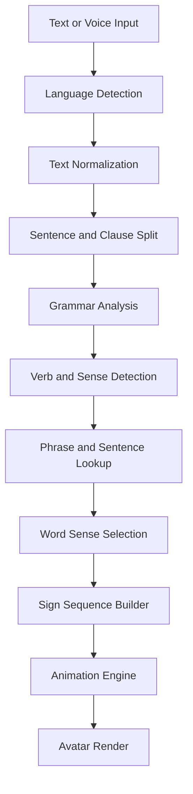

# SignVerse Sign Intelligence Blueprint

This document is the single practical plan for handling sentence signs, paragraph signs, voice input, connecting words, regional languages, verbs, and same-word-different-meaning cases in SignVerse.

## 1. Core Idea

Do not translate text directly into one sign per word.

Instead, translate in layers:

1. Input layer: text or voice
2. Language layer: detect the language and normalize it
3. Linguistic layer: split into sentence, clause, phrase, and verb units
4. Meaning layer: decide what the user actually means
5. Sign layer: pick the correct sign, sense, or phrase sign
6. Animation layer: render the chosen poses in order

This is the main ideology that makes all features work together.

## 2. What Each Feature Means

### Sentence Signs

Sentence signs are signs that represent the whole sentence meaning, not just the individual words.

Example:

- “How are you?” can be treated as one greeting-like sentence pattern.
- “I am going home now” can be converted into a time-first sign order.

Use sentence signs when:

- the sentence is common and repeated often
- the meaning is fixed
- a phrase sign already exists

### Paragraph Signs

Paragraph signs are not single signs. They are sign sequences that preserve the meaning of a whole paragraph.

Use paragraph-level processing when:

- the text has multiple related sentences
- there is a topic that continues across sentences
- the paragraph contains cause, contrast, sequence, or explanation

The engine should split the paragraph into chunks, preserve topic context, and sign each chunk in the correct order.

### Voice Input

Voice input is just another input method.

Flow:

1. Capture speech
2. Convert speech to text
3. Detect language
4. Normalize the text
5. Run the same sign pipeline as typed text

Important: voice input should not create a separate sign system. It should reuse the same translation engine.

### Connecting Words

Connecting words are words like:

- and
- or
- but
- because
- to
- of
- in
- on
- with

These words do not always need direct literal signs.

Possible handling:

- keep them if the language requires them
- convert them into grammar markers
- remove them if they do not add meaning in sign order

Example:

- “I went to school and came back”
- The engine may render this as two action chunks connected by a sequence marker instead of signing every small word literally.

### Regional Languages

Regional languages should not be separate logic islands.

Instead, use this flow:

1. detect the source language
2. translate or normalize into a common internal meaning form
3. map the meaning form to signs

This means Tamil, Malayalam, Hindi, or English can all enter the same sign pipeline.

### Verbs

Verbs are important because they define the action of the sentence.

The engine should identify:

- main verb
- auxiliary verb
- tense
- aspect
- direction or motion if relevant

Example:

- “She is eating”
- main verb: eat
- auxiliary: is
- tense: present

The sign engine can then decide whether to sign the auxiliary, the main verb, or both, depending on the language rules.

### Same Word, Different Meaning

This is the biggest practical issue.

Example:

- BAT = cricket bat
- BAT = animal

The word is the same, but the meaning is different.

So each word must support multiple senses.

## 3. Best Data Model

The current `words/*.json` design is good for single sign files, but for real language support you need a sense-based structure.

Recommended model:

```json
{
  "lexeme": "BAT",
  "senses": [
    {
      "sense_id": "bat_cricket",
      "meaning": "cricket bat",
      "pos": ["noun"],
      "context": ["cricket", "ball", "wicket", "game", "hit"],
      "poses": []
    },
    {
      "sense_id": "bat_animal",
      "meaning": "animal bat",
      "pos": ["noun"],
      "context": ["fly", "night", "cave", "wings"],
      "poses": []
    }
  ]
}
```

Recommended additions for other word types:

- phrase signs
- sentence signs
- paragraph markers
- verb metadata
- language tags
- regional variants

## 4. Lookup Strategy

The engine should resolve a sign in this order:

1. paragraph-level phrase
2. sentence-level phrase
3. multi-word phrase
4. word sense
5. fingerspelling fallback

This gives the best balance between natural signing and coverage.

### Decision Rule

If a token has multiple senses, use context clues:

- nearby words
- sentence topic
- part of speech
- language
- previous sentence context

If context is still unclear:

- ask the user
- show a disambiguation choice
- or use a neutral fallback label

## 5. Suggested Pipeline



## 6. How to Handle Each Requirement

### A. Sentence and Paragraph Signs

Implement these as chunk-based signs.

- sentence chunk: one sentence meaning block
- paragraph chunk: topic-level sequence of sentence blocks

The important thing is not to force every sentence into word-by-word output.

### B. Voice Input

Add speech-to-text before the sign engine.

The sign pipeline should not care whether the input came from a keyboard or microphone.

### C. Connecting Words

Add a grammar rule that marks function words as optional, structural, or mandatory.

Examples:

- optional: the, a, an
- structural: to, of, in
- semantic: and, but, because

### D. Regional Languages

Use a source-language detector and a normalization/translation step into one shared internal form.

That allows the same sign rules to serve all supported languages.

### E. Verbs

Use simple linguistic tagging to identify the main action.

The verb should control:

- signing order
- tense handling
- motion emphasis

### F. Same Word Different Meaning

Use sense IDs and context rules.

Do not store only one gesture per spelling if the word is ambiguous.

## 7. Practical File Strategy for SignVerse

Keep the current file-based gesture storage, but extend it like this:

- `words/` for normal word signs
- `phrases/` for multi-word signs
- `sentences/` for fixed sentence patterns
- `language_packs/` for regional language mappings
- `rules/` for grammar and disambiguation logic

If you want to keep the current structure minimal, you can still do it inside `words/*.json` by adding senses and metadata.

## 8. Recommended MVP Order

Build in this order:

1. sentence and phrase lookup
2. word sense disambiguation
3. verb identification
4. connecting-word cleanup
5. voice input
6. regional language normalization
7. paragraph chunking

This order gives the fastest visible improvement.

## 9. Example Behavior

Input:

“I played cricket with a bat and saw a bat at night.”

Expected interpretation:

- played cricket -> cricket context
- bat -> cricket bat
- bat at night -> animal bat

So the engine should choose different senses for the same spelling.

## 10. Final Rule

The system should always ask this question first:

What is the meaning here?

Not:

What is the word?

That one change is what makes the whole design work.
